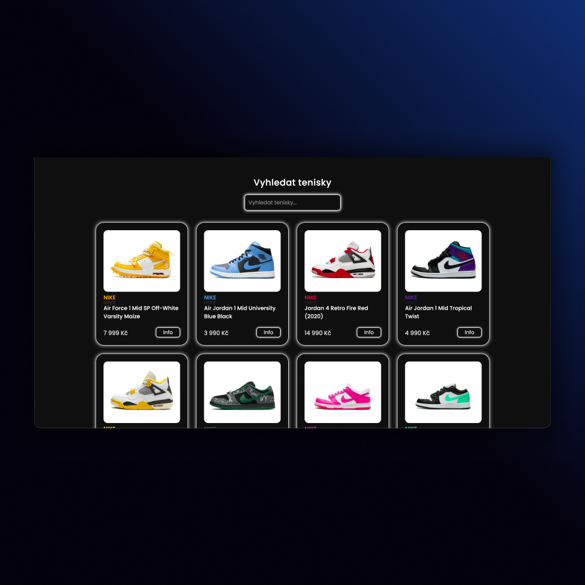

## 👟 Sneakers App
A modern and sleek web application for browsing and exploring premium sneaker collections.
This application provides an intuitive interface for sneaker enthusiasts to discover detailed information 
about their favorite footwear, featuring smooth animations and a responsive design optimized for all devices.

## 🚀 Features
• **Modern React Architecture** – Built with React 19 and TypeScript for type-safe development. <br>
• **Smooth Animations** – Powered by Framer Motion for fluid transitions and effects. <br>
• **Responsive Design** – Fully optimized for desktop, tablet, and mobile devices using Tailwind CSS. <br>
• **Dynamic Routing** – Client-side routing with React Router for seamless navigation. <br>
• **Search Functionality** – Filter sneakers by brand or model name. <br>
• **Sneaker Gallery** – Browse through a curated collection of premium sneakers. <br>
• **Detailed Views** – View comprehensive information about each sneaker model. <br>
• **Fast Performance** – Lightning-fast development and build times with Vite. <br>
• **Type Safety** – Full TypeScript support for better code quality and developer experience. <br>

## 📱 Screenshots  
 

## 🏃🏻 How to Run this App
1. Clone the repository: <br>
    • `git clone https://github.com/DejvCodes/Sneakers-App-React.git` <br>
    • `cd sneakers-app` <br>
2. Install dependencies: <br>
    • `npm install` <br>
3. Start the development server: <br>
    • `npm run dev` <br>
4. Build for production: <br>
    • `npm run build` <br>

## 💻 Tech Stack
[](https://skillicons.dev)

## 📁 Project Structure
```
src/
├── pages/
│   ├── AllSneakers.tsx        # Main gallery page with search
│   └── SneakerDetails.tsx     # Individual sneaker details
├── components/
│   └── OneSneaker.tsx         # Sneaker card component
├── data/
│   └── sneakers-app-data.ts   # Sneaker data collection
├── types/
│   └── types.ts               # TypeScript type definitions
├── function/
│   └── formatPrice.ts         # Utility functions
├── images/                    # Image assets
├── App.tsx                    # Main app component with routing
└── main.tsx                   # Application entry point

public/                        # Static assets
```

## 🌐 Live Demo
<a href="https://sneakers-app-dejvcodes.netlify.app/">Sneakers App</a>

## 🔐 License
[MIT License](LICENSE)
